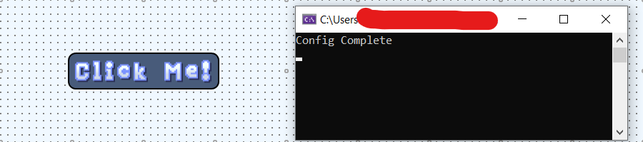
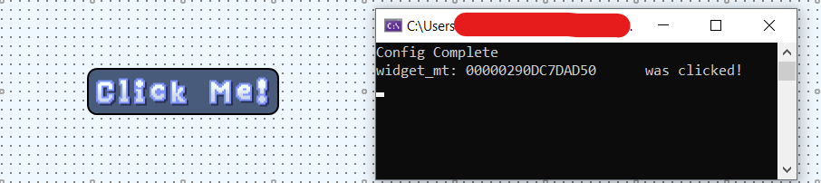

<!--Copyright 2023-2024 Kieran W Harvie. All rights reserved.
	Use of this source code is governed by an MIT-style
	license that can be found in the LICENSE file. -->
**:warning:While I'm proud of this repo and it was good learning experience it's now abandoned.:warning:**
# :goat: YALE :goat:

The Yale is a mythical goat like creature with an additional pair of tusks and horns that can swivel around.

<p align="center">
  
  <a href="https://en.wikipedia.org/wiki/Yale_(mythical_creature)">
    <br>
    A depiction of a yale from wikimedia commons. Note the backwards horn.
  </a>
</p>

But YALE also stands for "Yet Another Lua Engine", a succinct description of this project.


# Overview
The goal of this project is to create a GUI widget engine in pure-C [Allegro](https://liballeg.org/) that is scriptable by [Lua](https://www.lua.org/).
And the core of this project is the widget interface stack with a system of inbuilt callbacks based on user generated events.

The easiest way to show this would be showing the workflow for creating a button, setting it's location and text, and making it print to the console when clicked. 

## Lua Code
```lua
button = button{x=500, y=500, text="Click Me!"}

function button:left_click()
	print(self, " was clicked!")
end
```
## Rendered Button Pre-click


## Rendered Button Post-click


## Excerpt of Engine Code for Rendering the Button
```c
struct button
{
	struct wg_base;
	ALLEGRO_COLOR color;
	ALLEGRO_FONT* font;

	char text[];
};

static void draw(const struct wg_base* const wg)
{
	const struct button* const button = (const struct button* const)wg;

	al_draw_filled_rounded_rectangle(-wg->half_width, -wg->half_height, wg->half_width, wg->half_height,
		primary_pallet.edge_radius, primary_pallet.edge_radius,
		button->color);

	if (button->text)
		al_draw_text(button->font, al_map_rgb_f(1, 1, 1),
			0, -0.5 * al_get_font_line_height(button->font),
			ALLEGRO_ALIGN_CENTRE, button->text);

	al_draw_rounded_rectangle(-wg->half_width, -wg->half_height, wg->half_width, wg->half_height,
		primary_pallet.edge_radius, primary_pallet.edge_radius,
		primary_pallet.edge, primary_pallet.edge_width);
}
```
# Features 
Current features includes:
- Feature rich and customizable widget callback engine.
- Intuitive object based LUA interface.
- Material based shaders.
- Thread pool based multithreading.
- Lightweight resource manger, scheduler, and particle engine.
- Inbuilt logic for board/card game like widgets.

Full documentation of featured coming in the future!

# Why use YALE instead of other Lua game engine?
As suggested by the repository title, I'm well aware that a lot of game engines exist.
For those familiar with Lua in particular, the obvious question is why use YALE instead of [LÖVE](https://github.com/love2d/love)?

LÖVE is feature rich and well documented project with an active community and a history of releases going back decades.
And the YALE engine is all the better for existing in an ecosystem with such high quality projects as LÖVE.

My end goal for YALE is to provide customized and inbuilt logic for board/card games.
Until that time is reached LÖVE is the clear choice for most application,
but I hope to see you on the other side :salute:

# JIT?
LuaJIT is a Just-In-Time compiler for LUA that is meant to work as a drop in replacement for `lua51.dll`.

# Acknowledgments
## Code
Lua (5.1) [Website](https://www.lua.org/manual/5.1/)

LuaJIT [Website](https://luajit.org/)

Allegro (5.2) [Website](https://liballeg.org/)
## Art
(Note the art in the `res/` directory isn't included in the repo directly because that feels too close to their unmodified redistribution,
they will be incorporated into an upcoming full release).

Emily Huo (Font) [itch.io](https://emhuo.itch.io/)

bizinbarstome (Tile Art) [itch.io](https://bizinbarstome.itch.io/)

Game-Icons (Icons) [Website](https://game-icons.net)

Icons by:
- Lorc, http://lorcblog.blogspot.com
- Delapouite, https://delapouite.com
- John Colburn, http://ninmunanmu.com
- Felbrigg, http://blackdogofdoom.blogspot.co.uk
- John Redman, http://www.uniquedicetowers.com
- Carl Olsen, https://twitter.com/unstoppableCarl
- Sbed, http://opengameart.org/content/95-game-icons
- PriorBlue
- Willdabeast, http://wjbstories.blogspot.com
- Viscious Speed, http://viscious-speed.deviantart.com - CC0
- Lord Berandas, http://berandas.deviantart.com
- Irongamer, http://ecesisllc.wix.com/home
- HeavenlyDog, http://www.gnomosygoblins.blogspot.com
- Lucas
- Faithtoken, http://fungustoken.deviantart.com
- Skoll
- Andy Meneely, http://www.se.rit.edu/~andy/
- Cathelineau
- Kier Heyl
- Aussiesim
- Sparker, http://citizenparker.com
- Zeromancer - CC0
- Rihlsul
- Quoting
- Guard13007, https://guard13007.com
- DarkZaitzev, http://darkzaitzev.deviantart.com
- SpencerDub
- GeneralAce135
- Zajkonur
- Catsu
- Starseeker
- Pepijn Poolman
- Pierre Leducq
- Caro Asercion

